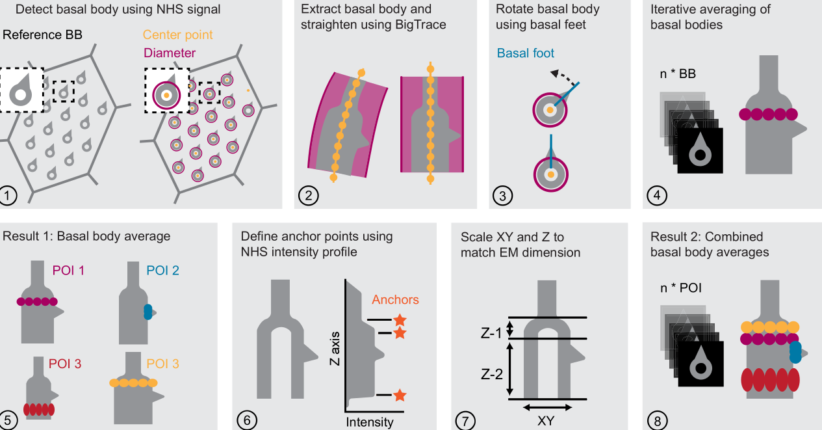

# averageBasalBodies  

   

This repository contains a set of [Fiji](https://fiji.sc/) macros   
for extraction, averaging and normalization (rescaling) of [basal bodies](https://en.wikipedia.org/wiki/Basal_body)  
from [expansion microscopy](https://en.wikipedia.org/wiki/Expansion_microscopy) volumetric datasets. 

The analysis workflow corresponds to the manuscript:  
**"Microtubule organization and molecular architecture of ciliary basal bodies in multiciliated airway cells"**   
van Grinsven et al., Current Biology 2026 [PubMed link](https://pubmed.ncbi.nlm.nih.gov/42019505/).  
The version used in manuscript is [0.0.2](https://github.com/UU-cellbiology/averageBasalBodies/releases/tag/0.0.2)   
 
Higher version numbers contain bug fixes and optimizations.   
Please use them for the analysis.    

For the full documentation, please refer to the **[wiki](https://github.com/UU-cellbiology/extractBasalBodies/wiki)**.

   

----------

Developed in <a href='http://cellbiology.science.uu.nl/'>Cell Biology group</a> of Utrecht University.  
   

